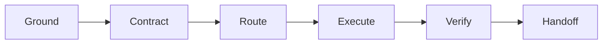

# deliver-with-evidence

[简体中文](README.zh-CN.md) · [Skill instructions](skills/deliver-with-evidence/SKILL.md) · [Contributing](CONTRIBUTING.md)

**A delivery protocol for AI agents: keep scope, authority, implementation, verification, and handoff connected.**

Use `deliver-with-evidence` when a task must become a finished, observable result rather than stop at an edit, a passing upstream check, or a confident summary. Specialist skills still decide the technical method; this skill coordinates the delivery lifecycle and makes the final state explicit.

The English README is the canonical project documentation. The Simplified Chinese version mirrors the same behavior contract.

## Quick start

### Install

Use GitHub CLI 2.90.0 or later. Preview the skill, then install it for Codex at user scope. Without an explicit version, GitHub CLI selects the latest tagged release and falls back to the default branch when no release tag exists:

```console
gh skill preview TogawaSakiko-desuwa/deliver-with-evidence deliver-with-evidence
gh skill install TogawaSakiko-desuwa/deliver-with-evidence deliver-with-evidence --agent codex --scope user
gh skill list --agent codex --scope user
```

The final command confirms where the skill was installed.

<details>
<summary>Pin v0.1.0 after that tag is published</summary>

```console
gh skill install TogawaSakiko-desuwa/deliver-with-evidence deliver-with-evidence@v0.1.0 --agent codex --scope user
```

</details>

<details>
<summary>Install manually or use another Agent Skills host</summary>

Copy `skills/deliver-with-evidence/` into a skills directory supported by your host. The [`gh skill install`](https://cli.github.com/manual/gh_skill_install) manual documents supported agents, scopes, and version pinning.

</details>

### Try it

Codex implicit invocation is intentionally disabled in v0.1.0. Adapt this prompt to a real repository and include `$deliver-with-evidence` when you want end-to-end delivery:

```text
$deliver-with-evidence Fix the CSV import crash, preserve the public API,
add a regression test, run the relevant checks, and verify the installed CLI.
Do not commit or push.
```

A typical handoff looks like this; it is an illustrative human-readable format, not a machine protocol:

```text
Work status: complete
Outcome evidence: verified

Changed: handled empty CSV input and added a process-level regression test.
Evidence: focused and full tests passed; the installed CLI returned the expected output.
Not performed: commit, push, deployment, or any other external write.
```

Invoking the skill does not expand the authority granted by the rest of the request.

For a genuinely small edit, the same protocol stays light:

```text
$deliver-with-evidence Correct the single misspelling in the command help text
and verify the displayed help output.
```

That is a Fast-lane task: the target, exclusions, authority boundary, and decisive check remain internal, while the handoff reports only the change and current user-visible evidence.

## What you get

| Behavior contract | What it changes |
| --- | --- |
| **Scoped contract** | The agent fixes the goal, deliverables, success criteria, constraints, and stop conditions before substantive implementation. |
| **Authority boundaries** | Local work is kept separate from commits, pushes, submissions, deployments, publication, messages, deletion, and other consequential transitions. |
| **Outcome evidence** | Verification targets the final observable effect, not only an upstream unit test, source file, or API response. |
| **Honest handoff** | Work completion and outcome evidence are reported on two independent axes, with unfinished or externally pending stages named explicitly. |

The skill is designed for code, documents, data, interfaces, runtime configuration, deployments, and explicitly authorized external systems.

## When to use it

| Use `deliver-with-evidence` when… | Use the normal agent flow when… |
| --- | --- |
| a concrete change or artifact spans several steps; | you only need an answer, lookup, brainstorm, or plan; |
| the user-visible result needs proof at a public or rendered boundary; | you requested diagnosis or review without implementation; |
| specialist skills, tools, or parallel work must stay aligned to one contract; | a one-step, low-risk edit has an obvious decisive check; |
| local work may approach an external, destructive, sensitive, or production boundary. | there is no concrete deliverable to carry through verification. |

Explicit invocation still respects the requested task type. It will not turn a diagnosis-only or review-only request into an implementation.

## How it works



| Phase | Purpose |
| --- | --- |
| **Ground** | Inspect the real workspace, instructions, baseline, target, risks, and available checks. |
| **Contract** | Lock the goal, deliverables, success criteria, scope, constraints, authority, and required evidence. |
| **Route** | Select the smallest useful set of specialist skills and parallel work. |
| **Execute** | Build the minimum useful vertical slice while preserving unrelated work and promotion boundaries. |
| **Verify** | Exercise the final observable effect and map every success criterion to current evidence. |
| **Handoff** | State what changed, what was verified, what remains, and the exact delivery state. |

The workflow uses the lightest lane that can preserve safety and proof:

| Lane | Use it for |
| --- | --- |
| **Fast** | Small, reversible work with obvious scope and one decisive check. |
| **Standard** | Non-trivial local artifacts and multi-step changes. |
| **High-risk** | Destructive or irreversible changes, sensitive data, production/runtime promotion, public writes, or other consequential external mutations. |

## Where it fits

| Layer | Responsibility |
| --- | --- |
| **Specialist skills** | Decide the domain technique for debugging, testing, documents, UI, deployment, provider operations, and similar work. |
| **Tests and CI** | Run automated checks at the boundaries they cover. |
| **`deliver-with-evidence`** | Connect the requested outcome, authority, implementation, final-effect evidence, and handoff across those techniques and checks. |

It is an orchestration protocol, not another domain implementation method and not a replacement for CI.

## More example prompts

### Deliver a user-visible artifact

```text
$deliver-with-evidence Update the onboarding PDF from the supplied source.
Preserve the brand styles, confirm every required section is present, render every
page for visual inspection, and place the final PDF in the requested output folder.
```

The source edit is not enough: the final PDF must be generated and inspected with the applicable artifact workflow.

### Stop at an external promotion boundary

```text
$deliver-with-evidence Prepare the release, run the release checks, push the release
branch, and open a draft pull request in OWNER/REPO. Do not merge, publish a release,
or deploy anything.
```

The exact repository and branch are resolved before the authorized writes and read back afterward. A draft pull request is not reported as merged, released, deployed, or externally accepted.

## Status model

Every handoff reports two independent axes.

### Work status

| State | Meaning |
| --- | --- |
| `complete` | Every requested deliverable within the agreed scope is finished. |
| `partial` | A meaningful subset is delivered, but a requested part remains unfinished. |
| `blocked` | Missing input, access, environment, authority, or dependency prevents meaningful progress. |

### Outcome evidence

| State | Meaning |
| --- | --- |
| `verified` | Current evidence demonstrates the requested observable outcome. |
| `needs-user-validation` | The implementation is ready, but acceptance depends on the user's judgment or environment. |
| `waiting-external` | The explicitly requested submission or deployment state has been reached and read back, but a third party or system is still pending. |
| `not-reached` | Work stopped before outcome evidence could be obtained. |

For example, a fully prepared and submitted change can be `complete + waiting-external`. A finished visual artifact that needs subjective approval can be `complete + needs-user-validation`. A fully implemented local change whose required real hardware verifier is unavailable can be `complete + not-reached`; a failed check caused by an unresolved in-scope defect cannot. `partial + verified` means the completed subset has reached its own required boundary with current proof while every unfinished stage is named separately; `partial + not-reached` means a deliverable remains unfinished and the missing verifier, authority, access, or environment also prevents outcome evidence at its required boundary.

Only these combinations are valid:

| Work status | Allowed outcome evidence |
| --- | --- |
| `complete` | `verified`, `needs-user-validation`, `waiting-external`, or `not-reached` |
| `partial` | `verified`, `needs-user-validation`, `waiting-external`, or `not-reached` |
| `blocked` | `not-reached` only |

## Authority and safety

Authority stays limited to the systems, data, people, targets, and outcome named by the user.

- Read-only inspection, reversible local edits, and proportionate verification may proceed when needed for an authorized local implementation.
- External writes and high-risk actions require explicit authority for the exact resolved target.
- Local modification does not imply permission to commit, push, submit, deploy, publish, send, merge, or delete.
- An authorized promotion target is exact: a draft is not a review-ready submission, a push is not a pull request, and an open pull request is not a merge.
- An explicit exact end-state request covers only the indispensable intermediate transitions to that same resolved target unless the user excludes them; host approvals still apply.
- Promotion remains a sequence of distinct states: `draft/generated → staged → locally verified → submitted/deployed → externally accepted`.
- Sensitive information stays out of prompts, logs, diffs, checkpoints, and evidence unless its transfer is necessary and explicitly authorized.
- When authority ends, the agent completes safe in-scope work and stops at the last reversible boundary.

This skill is a behavioral protocol, not a security sandbox. Keep the host's approval, credential, filesystem, network, and provider controls enabled. See [SECURITY.md](SECURITY.md) and the detailed [risk and authority reference](skills/deliver-with-evidence/references/risk-and-authority.md).

## Non-goals

`deliver-with-evidence` does not:

- replace specialist skills or their required verification workflows;
- grant tool permissions or bypass host controls;
- infer authorization for external or destructive actions;
- guarantee approval, merge, delivery, deployment, or acceptance by a third party; or
- justify speculative architecture, unrelated cleanup, or automation beyond the smallest useful delivered outcome.

## Evidence and release status

> [!IMPORTANT]
> This repository targets **v0.1.0 public preview**. CI validates the published skill against a pinned Agent Skills reference validator. Behavioral release qualification is not yet claimed, and the behavior contract and GitHub CLI's public-preview `gh skill` interface may still change.

| Evidence | Current result |
| --- | --- |
| Agent Skills reference validator | Pinned and configured in [CI](.github/workflows/validate.yml) |
| GitHub publication check | Run `gh skill publish --dry-run` before release |
| Behavioral release qualification | Not yet claimed for the v0.1.0 public preview |

Structural validation is not evidence that a model passed a behavioral scenario. Behavior changes still require clean-context validation and a sanitized summary in the pull request.

## Compatibility

The skill follows the [Agent Skills specification](https://agentskills.io/specification) and uses the conventional `skills/deliver-with-evidence/SKILL.md` layout.

| Host | Status |
| --- | --- |
| Codex | Primary target for v0.1.0; behavioral release qualification is not yet claimed. |
| GitHub CLI | Discovery, preview, installation, and publication validation use the public-preview `gh skill` commands. |
| Other Agent Skills hosts | Structurally compatible where the specification is supported; behavioral compatibility is not yet claimed. |

Explicit invocation syntax is host-specific: use `$deliver-with-evidence` in Codex and `/deliver-with-evidence` in Claude Code. Host-specific metadata in `agents/openai.yaml` may be ignored by other clients. Tool availability, approval semantics, collaboration modes, automatic activation, and specialist-skill routing remain host-dependent.

## Repository map

```text
skills/deliver-with-evidence/
├── SKILL.md                    # Workflow entry point
├── agents/openai.yaml          # Codex interface metadata
└── references/                 # Contract, authority, and verification detail
.github/workflows/validate.yml  # Public structural validation
README.md                       # Canonical project documentation
README.zh-CN.md                 # Simplified Chinese documentation
CONTRIBUTING.md                 # Contribution policy
SECURITY.md                     # Security policy
CHANGELOG.md                    # Public behavior history
LICENSE                         # MIT License
```

The skill keeps essential instructions in [`SKILL.md`](skills/deliver-with-evidence/SKILL.md) and loads detailed references only when relevant.

## Project policy

- [CONTRIBUTING.md](CONTRIBUTING.md) — contribution and behavior-change requirements
- [SECURITY.md](SECURITY.md) — vulnerability reporting and security scope
- [CHANGELOG.md](CHANGELOG.md) — public behavior changes
- [MIT License](LICENSE)
