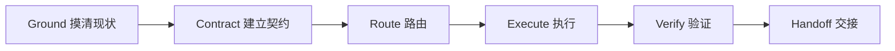

# deliver-with-evidence

[English](README.md) · [Skill 指令](skills/deliver-with-evidence/SKILL.md) · [参与贡献](CONTRIBUTING.md)

**一个面向 AI Agent 的交付协议：把范围、授权、实现、验证和交接始终连在一起。**

当任务必须形成一个完成且可观察的结果，而不能停在“改过文件”“上游检查通过”或一段自信的总结时，可以使用 `deliver-with-evidence`。专业 skill 仍负责选择具体技术方法；本 skill 负责协调完整交付过程，并如实说明最终到达了什么状态。

英文 README 是项目的权威说明；本中文版本与其保持同一行为契约。

## 快速开始

### 安装

请使用 GitHub CLI 2.90.0 或更高版本。先预览 skill，再把它安装到 Codex 用户级范围。没有指定版本时，GitHub CLI 会选择最新发布标签；如果尚无发布标签，则回退到默认分支：

```console
gh skill preview TogawaSakiko-desuwa/deliver-with-evidence deliver-with-evidence
gh skill install TogawaSakiko-desuwa/deliver-with-evidence deliver-with-evidence --agent codex --scope user
gh skill list --agent codex --scope user
```

最后一条命令用于确认 skill 的安装位置。

<details>
<summary>v0.1.0 标签发布后固定安装该版本</summary>

```console
gh skill install TogawaSakiko-desuwa/deliver-with-evidence deliver-with-evidence@v0.1.0 --agent codex --scope user
```

</details>

<details>
<summary>手动安装或用于其他 Agent Skills 宿主</summary>

把 `skills/deliver-with-evidence/` 复制到宿主支持的 skills 目录。支持的 Agent、安装范围和版本锁定方式见 [`gh skill install`](https://cli.github.com/manual/gh_skill_install) 官方手册。

</details>

### 立即试用

v0.1.0 在 Codex 上刻意关闭了隐式调用。把下面的提示改成你仓库里的真实任务；需要端到端交付时，请明确加入 `$deliver-with-evidence`：

```text
$deliver-with-evidence 修复 CSV 导入崩溃，保持公共 API 兼容，
添加回归测试，运行相关检查，并验证安装后的 CLI。不要 commit 或 push。
```

一次典型交接大致如下；它是便于人阅读的示例，并非强制机器协议：

```text
Work status: complete
Outcome evidence: verified

改动：处理了空 CSV 输入，并增加进程级回归测试。
证据：聚焦测试与完整测试均通过；安装后的 CLI 返回预期结果。
未执行：commit、push、部署或任何其他外部写入。
```

调用本 skill 不会扩大请求其余部分已经授予的权限。

如果确实只是一个小改动，同一套协议会保持轻量：

```text
$deliver-with-evidence 修正命令帮助文本中的一个拼写错误，
并验证实际显示的帮助输出。
```

这是 Fast 通道任务：目标、排除项、授权边界和决定性检查保留在内部；交接只报告改动与当前用户可见证据。

## 你会得到什么

| 行为约定 | 它带来的改变 |
| --- | --- |
| **范围契约** | 在实质实现前确定目标、交付物、成功标准、约束与停止条件。 |
| **授权边界** | 把本地工作与 commit、push、提交、部署、发布、发送、删除及其他后果重大的状态转换分开处理。 |
| **结果证据** | 验证最终可观察效果，而不只验证上游单测、源文件或 API 响应。 |
| **诚实交接** | 用两条独立状态轴报告工作完成度与结果证据，并明确列出未完成或仍在等待外部状态的阶段。 |

这个 skill 面向代码、文档、数据、界面、运行配置、部署，以及已经明确授权的外部系统操作而设计。

## 什么时候使用

| 适合使用 `deliver-with-evidence` | 适合使用普通 Agent 流程 |
| --- | --- |
| 一个具体改动或制品需要多个步骤才能完成； | 只需要回答、检索、头脑风暴或规划； |
| 必须在公开边界、渲染结果等用户可见位置证明效果； | 用户要求的只是诊断或审查，不包含实现； |
| 多个专业 skill、工具或并行工作必须遵守同一契约； | 只是一个低风险、一步完成且有明显决定性检查的小改动； |
| 本地工作可能接近外部、破坏性、敏感数据或生产环境边界。 | 没有需要一路推进到验证的具体交付物。 |

即使被明确调用，本 skill 仍会遵守用户要求的任务类型，不会把“仅诊断”或“仅审查”擅自升级为实现。

## 它如何工作



| 阶段 | 目的 |
| --- | --- |
| **Ground（摸清现状）** | 检查真实工作区、约束、基线、目标、风险和可用验证。 |
| **Contract（建立契约）** | 锁定目标、交付物、成功标准、范围、限制、权限和所需证据。 |
| **Route（路由）** | 选择最少但足够的专业 skill 与并行工作。 |
| **Execute（执行）** | 实现最小有用纵向切片，保护无关改动与发布/上线边界。 |
| **Verify（验证）** | 验证最终可观察效果，并为每条成功标准建立当前证据。 |
| **Handoff（交接）** | 说明改了什么、验证了什么、还缺什么，以及真实交付状态。 |

工作流会选择仍能保证安全与证据的最轻执行通道：

| 通道 | 适用场景 |
| --- | --- |
| **Fast** | 范围明显、小型且可逆，并有一项决定性检查。 |
| **Standard** | 复杂本地制品或多步骤改动。 |
| **High-risk** | 破坏性或不可逆改动、敏感数据、生产/运行态发布、公开写入或其他后果重大的外部操作。 |

## 它处在什么位置

| 层次 | 职责 |
| --- | --- |
| **专业 skill** | 决定调试、测试、文档、UI、部署、服务商操作等领域的具体技术方法。 |
| **测试与 CI** | 在各自覆盖的边界执行自动化检查。 |
| **`deliver-with-evidence`** | 跨越这些方法与检查，连接用户目标、授权、实现、最终效果证据和交接。 |

它是交付编排协议，不是另一套领域实现方法，也不取代 CI。

## 更多提示示例

### 交付用户可见制品

```text
$deliver-with-evidence 根据提供的源文件更新入门 PDF。保留品牌样式，
确认每个必需章节都存在，渲染并目检每一页，然后把最终 PDF 放进指定输出目录。
```

只修改源文件还不够：必须使用适用的制品工作流生成并检查最终 PDF。

### 停在外部发布边界

```text
$deliver-with-evidence 准备发布，运行发布检查，推送 release 分支，
并在 OWNER/REPO 创建草稿 PR。不要合并、发布 Release 或部署。
```

执行获授权写入前，先解析确切仓库与分支；执行后再回读远端状态。草稿 PR 不能被报告成已合并、已发布、已部署或已被外部接受。

## 状态模型

每次交接都要报告两条相互独立的状态轴。

### Work status（工作状态）

| 状态 | 含义 |
| --- | --- |
| `complete` | 约定范围内的所有交付物均已完成。 |
| `partial` | 已交付有意义的子集，但仍有用户要求的部分未完成。 |
| `blocked` | 缺少输入、访问、环境、授权或依赖，无法继续取得实质进展。 |

### 结果证据

| 状态 | 含义 |
| --- | --- |
| `verified` | 当前证据能够证明用户要求的可观察结果。 |
| `needs-user-validation` | 实现已经就绪，但验收取决于用户判断或用户环境。 |
| `waiting-external` | 用户明确要求的提交或部署状态已经到达并回读确认，但第三方人员或系统仍在等待中。 |
| `not-reached` | 在取得结果证据之前工作已经停止。 |

例如，已完整准备并提交的改动可以是 `complete + waiting-external`；本地完成但仍需主观验收的视觉制品可以是 `complete + needs-user-validation`；所有本地交付物均已实现、但必需真实硬件验证器不可用时，可以是 `complete + not-reached`，而由范围内缺陷导致的检查失败不能这样报告。`partial + verified` 表示已完成部分已经到达自身要求的可观察边界并拥有当前证据，同时所有未完成阶段都被单独列出；`partial + not-reached` 表示仍有交付物未完成，并且缺少验证器、授权、访问或环境也阻止其在要求的边界取得结果证据。

只有以下组合有效：

| Work status（工作状态） | 允许的结果证据 |
| --- | --- |
| `complete` | `verified`、`needs-user-validation`、`waiting-external` 或 `not-reached` |
| `partial` | `verified`、`needs-user-validation`、`waiting-external` 或 `not-reached` |
| `blocked` | 只能是 `not-reached` |

## 授权与安全

授权始终限定在用户点名的系统、数据、人员、目标和结果内。

- 如果只读检查、可逆本地编辑和相称验证是获授权本地实现的必要步骤，可以执行。
- 外部写入和高风险操作必须获得针对确切目标的明确授权。
- 允许本地修改不等于允许 commit、push、提交、部署、发布、发送、合并或删除。
- 获授权的发布目标状态必须精确：草稿不等于已可供审查的提交，push 不等于 PR，已打开的 PR 也不等于已合并。
- 对明确终态的请求，只涵盖到达同一已解析目标所不可缺少的中间转换，除非用户将其排除；宿主审批仍然适用。
- 发布过程中的状态必须分开记录：`draft/generated → staged → locally verified → submitted/deployed → externally accepted`。
- 除非传输既必要又得到明确授权，否则敏感信息不得进入提示、日志、diff、恢复点或验证证据。
- 授权到达边界时，应完成其余安全且范围内的工作，并停在最后一个可逆节点。

这个 skill 是行为协议，不是安全沙箱。请继续启用宿主的审批、凭据、文件系统、网络和服务商控制。详见 [SECURITY.md](SECURITY.md) 与完整的[风险和授权参考](skills/deliver-with-evidence/references/risk-and-authority.md)。

## 非目标

`deliver-with-evidence` 不会：

- 取代专业 skill 及其要求的验证工作流；
- 赋予工具权限或绕过宿主控制；
- 推断用户已授权外部或破坏性操作；
- 保证第三方会批准、合并、送达、部署或接受结果；
- 为猜测式架构、无关清理或超出最小有用交付的自动化寻找理由。

## 证据与发布状态

> [!IMPORTANT]
> 本仓库当前以 **v0.1.0 public preview** 为目标。CI 使用固定版本的 Agent Skills 参考验证器检查公开 skill。项目目前不宣称已通过行为发布资格验证；稳定版之前，行为契约与 GitHub CLI 公开预览中的 `gh skill` 接口仍可能变化。

| 证据 | 当前结果 |
| --- | --- |
| Agent Skills 参考验证器 | 已在 [CI](.github/workflows/validate.yml) 中固定版本并配置执行 |
| GitHub 发布检查 | 发布前运行 `gh skill publish --dry-run` |
| 行为发布资格 | v0.1.0 public preview 目前不作已通过声明 |

结构校验不能证明模型已经通过某个行为场景。行为变更仍需在干净上下文中验证，并在拉取请求中提供脱敏摘要。

## 兼容性

该 skill 遵循 [Agent Skills 规范](https://agentskills.io/specification)，使用标准的 `skills/deliver-with-evidence/SKILL.md` 布局。

| 宿主 | 状态 |
| --- | --- |
| Codex | v0.1.0 的首要目标；目前不宣称已通过行为发布资格验证。 |
| GitHub CLI | 使用公开预览中的 `gh skill` 命令进行发现、预览、安装和发布校验。 |
| 其他 Agent Skills 宿主 | 支持该规范时结构兼容；目前不宣称行为已经验证。 |

显式调用语法取决于宿主：Codex 使用 `$deliver-with-evidence`，Claude Code 使用 `/deliver-with-evidence`。`agents/openai.yaml` 中的宿主专用元数据可能被其他客户端忽略。工具可用性、审批语义、协作模式、自动触发和专业 skill 路由仍取决于宿主。

## 仓库结构

```text
skills/deliver-with-evidence/
├── SKILL.md                    # 工作流入口
├── agents/openai.yaml          # Codex 界面元数据
└── references/                 # 契约、授权与验证细节
.github/workflows/validate.yml  # 公开结构校验
README.md                       # 权威项目文档
README.zh-CN.md                 # 简体中文文档
CONTRIBUTING.md                 # 贡献政策
SECURITY.md                     # 安全政策
CHANGELOG.md                    # 对外行为历史
LICENSE                         # MIT 许可证
```

skill 把必要指令放在 [`SKILL.md`](skills/deliver-with-evidence/SKILL.md)，只在相关时加载详细参考资料。

## 项目政策

- [CONTRIBUTING.md](CONTRIBUTING.md) — 贡献要求与行为变更规则
- [SECURITY.md](SECURITY.md) — 漏洞报告与安全范围
- [CHANGELOG.md](CHANGELOG.md) — 对外行为变更
- [MIT License](LICENSE)
